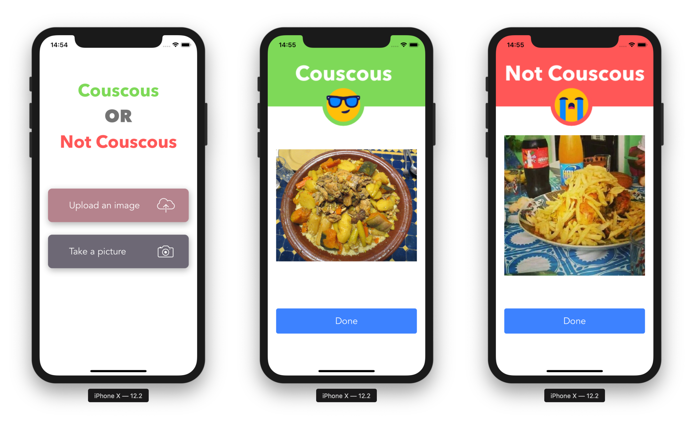
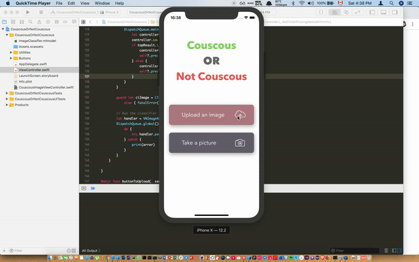

# Couscous or Not Couscous — Let CoreML Decide
>Training a model in an iOS application

Yes, that’s right. I built an iOS app that looks at a picture and decides whether it’s couscous or not couscous.

## Full Tutorial

I've wrote a full medium tutorial:

**[Medium Article](https://medium.com/better-programming/couscous-or-not-couscous-let-coreml-decide-ios-application-512845bc79b8)**

## Final Result:

**Here’s the final result:**

## About me

**Omar MHAIMDAT** 

* [Linkedin](https://www.linkedin.com/in/omarmhaimdat/)
* **Email:** omarmhaimdat@gmail.com
* [Look at the rest of my repos](https://github.com/omarmhaimdat/)

Distributed under the MIT license. See ``LICENSE`` for more information.